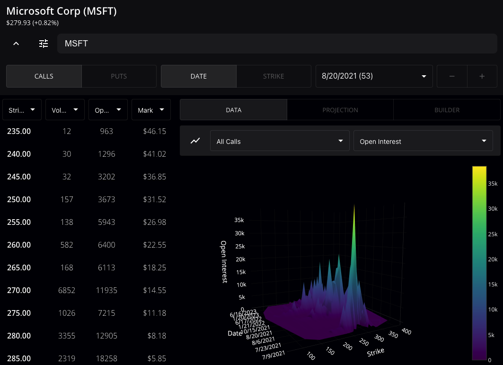

# Investalyze
Analytics for stock market and options trading.



## How to Install

#### Note: Instructions assume Node.js and npm are installed on a Unix-based system with a properly configured LAMP stack.
 - Tested configuration: Ubuntu 18.04, Node 12.20.0, npm 6.14.8, Apache server 2.4.29, PHP 7.4.10

### Automated Install
 - In the parent folder of where you want to set up the environment, download the following script:
   ```
   wget https://noahsadir.io/resources/scripts/investalyze-react-install.sh
   ```
 - Inspect the script, then run:
   ```
   sh investalyze-react-install.sh
   ```
Alternatively, you can set up the environment manually.

### Manual Install
- Create an empty react app. These instructions assume the app is named "investalyze"
  ```
  npx create-react-app investalyze
  ```
- Navigate to react app and clone repository into temporary directory.
  ```
  cd investalyze
  git clone https://github.com/noahsadir/investalyze-new.git ./tmp
  ```
- Overwrite files created by create-react-app with those from repository, then delete temp folder
  ```
  # RUN COMMANDS BELOW WITH CAUTION
  cp -r tmp/* ./
  rm -r ./tmp
  ```
- Install required packages:
  ```
  # Using Yarn:
  # yarn add [DEPENDENCY]

  fontsource-open-sans
  @material-ui/core
  @material-ui/lab
  react-split-pane
  black-scholes
  implied-volatility
  greeks
  react-chartjs-2 chart.js
  react-plotly.js plotly.js
  plotly.js-gl3d-dist
  ```

#### A Note on Memory Requirements

Web servers or computers with <= 2GB RAM may encounter out-of-memory issues when compiling. To fix this, remove Plotly and all references to it (3D charts will no longer work, obviously).

This is also why ChartJS is used for non-3D charts, as I wanted to minimize usage of Plotly due to my personal web server having only 2 GB of RAM.

You may also notice some JSdoc comments in the source code. While I wanted to have proper documentation, the library requires quite a lot of memory and is extremely difficult to compile together with Plotly in a low memory environment.

### Post-configuration Setup

This application uses the [Tradier Brokerage API](https://documentation.tradier.com/brokerage-api) to fetch market data.

After you obtain an API Key for the *Developer Sandbox*, you should enter it into the text field located in the Settings dialog.
